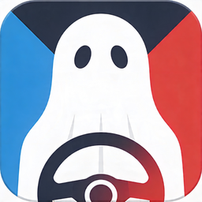

  

# PaceGhost

**Real-time iRacing overlay — compare your inputs against a reference lap**

---

PaceGhost is a lightweight Windows overlay for iRacing that lets you compare your throttle, brake, gear, and lap delta against a reference lap in real time — directly on top of the simulator, with zero performance impact.

Import a CSV from [Garage61](https://garage61.net), open iRacing, and PaceGhost will show you exactly where you gain and lose time against your best lap or a faster driver.

---

## Features

- **Throttle & Brake overlay** — live bars side-by-side with reference lap inputs
- **Gear overlay** — current gear vs. reference gear with mismatch alert
- **Delta overlay** — live time delta bar vs. reference lap
- **Trace overlay** — throttle/brake trace graph for the last few seconds
- **Next Brake overlay** — distance to the next braking zone with max brake pressure reference and live peak comparison
- **Audio alerts** — optional sound cues for brake and throttle events
- **Per-overlay visibility & opacity controls** — customise what you see and how prominent it is
- **Show overlays without iRacing open** — position your overlays before launching the sim
- **Persistent window positions** — overlays remember where you placed them

---

## Requirements

- Windows 10 or later (64-bit)
- [iRacing](https://www.iracing.com) subscription
- Reference lap CSV exported from [Garage61](https://garage61.net)

---

## Installation

1. Go to the [Releases](../../releases) page
2. Download the latest `PaceGhost-Setup-x.x.x.exe`
3. Run the installer and follow the on-screen steps
4. Launch **PaceGhost** from the Start Menu or Desktop shortcut

No admin rights required after installation.

---

## Getting Started

### 1. Export a reference lap from Garage61

- Open [garage61.net](https://garage61.net) and find the lap you want to use as reference
- Export it as a **CSV file**

### 2. Import the CSV into PaceGhost

- Launch PaceGhost — it will appear in your taskbar
- Click the **📂 Import CSV** button in the top bar
- Select the exported CSV file

### 3. Launch iRacing

- Once iRacing connects, the overlays will appear automatically on screen
- Drive your lap — PaceGhost will compare your inputs in real time

### 4. Adjust your overlays

- Use the **Settings panel** to toggle individual overlays on/off
- Drag any overlay to reposition it — positions are saved automatically
- Use the **Opacity** slider to adjust overlay visibility

---

## Overlays

| Overlay              | Description                                                             |
| -------------------- | ----------------------------------------------------------------------- |
| **Throttle / Brake** | Live and reference throttle & brake bars                                |
| **Gear**             | Current gear vs. reference gear with mismatch highlight                 |
| **Delta**            | Time delta bar — green when ahead, red when behind                      |
| **Trace**            | Rolling throttle/brake trace for the last few seconds                   |
| **Next Brake**       | Distance to next braking zone, max brake reference, and peak comparison |

---

## Settings

| Setting                               | Description                                                                              |
| ------------------------------------- | ---------------------------------------------------------------------------------------- |
| **Som geral / Master audio**          | Enable or disable all audio alerts                                                       |
| **Aviso travagem / Brake alert**      | Audio cue when entering a brake zone                                                     |
| **Aviso acelerador / Throttle alert** | Audio cue on throttle events                                                             |
| **Tolerância travagem (±%)**          | Tolerance for brake peak comparison (default: ±5%)                                       |
| **Show overlays without iRacing**     | Show all overlays even when iRacing is not running (for positioning) — resets on restart |
| **Opacidade / Opacity**               | Global overlay opacity (20–100%)                                                         |

---

## Troubleshooting

**Overlays don't appear when iRacing starts**

- Make sure you imported a CSV before launching iRacing
- Check that the overlays are enabled in the Settings panel
- The Next Brake overlay only appears after a CSV has been imported

**"No Signal" badge stays on**

- PaceGhost connects to iRacing via the telemetry SDK — make sure iRacing is running and you are in a session (practice, qualify, or race)

**Overlays are behind the game window**

- iRacing should be running in **Borderless Window** mode for overlays to appear on top

---

## License

© 2026 Tiago Rocha — Free to use and distribute in original form. Modification or reuse requires written consent.

---

---

# 🇵🇹 Versão em Português

---

O PaceGhost é um overlay leve para Windows que te permite comparar os teus inputs de acelerador, travão, caixa e delta de tempo contra uma volta de referência em tempo real — diretamente por cima do iRacing, sem impacto na performance.

Importa um CSV do [Garage61](https://garage61.net), abre o iRacing, e o PaceGhost mostra-te exatamente onde ganhas e perdes tempo face à tua melhor volta ou a um piloto mais rápido.

---

## Funcionalidades

- **Overlay Acelerador & Travão** — barras em tempo real lado a lado com os inputs da volta de referência
- **Overlay Caixa** — marcha atual vs. marcha de referência com alerta de discrepância
- **Overlay Delta** — barra de diferença de tempo em tempo real vs. volta de referência
- **Overlay Trace** — gráfico de acelerador/travão dos últimos segundos
- **Overlay Next Brake** — distância até à próxima zona de travagem com referência de pressão máxima e comparação de pico ao vivo
- **Alertas de áudio** — avisos sonoros opcionais para travagem e acelerador
- **Controlo de visibilidade e opacidade por overlay** — personaliza o que vês e com que destaque
- **Mostrar overlays sem o iRacing aberto** — posiciona os teus overlays antes de lançar o simulador
- **Posições de janela persistentes** — os overlays lembram-se de onde os colocaste

---

## Requisitos

- Windows 10 ou posterior (64-bit)
- Subscrição [iRacing](https://www.iracing.com)
- CSV de volta de referência exportado do [Garage61](https://garage61.net)

---

## Instalação

1. Vai à página de [Releases](../../releases)
2. Descarrega o ficheiro `PaceGhost-Setup-x.x.x.exe` mais recente
3. Corre o instalador e segue os passos
4. Lança o **PaceGhost** a partir do Menu Iniciar ou atalho no Ambiente de Trabalho

Não são necessárias permissões de administrador após a instalação.

---

## Como começar

### 1. Exporta uma volta de referência do Garage61

- Abre o [garage61.net](https://garage61.net) e encontra a volta que queres usar como referência
- Exporta-a como ficheiro **CSV**

### 2. Importa o CSV no PaceGhost

- Lança o PaceGhost — vai aparecer na barra de tarefas
- Clica no botão **📂 Importar CSV** na barra superior
- Seleciona o ficheiro CSV exportado

### 3. Lança o iRacing

- Quando o iRacing ligar, os overlays aparecem automaticamente no ecrã
- Conduz a tua volta — o PaceGhost compara os teus inputs em tempo real

### 4. Ajusta os teus overlays

- Usa o **painel de Settings** para ligar/desligar overlays individualmente
- Arrasta qualquer overlay para o reposicionar — as posições são guardadas automaticamente
- Usa o slider de **Opacidade** para ajustar a visibilidade dos overlays

---

## Overlays

| Overlay              | Descrição                                                                                  |
| -------------------- | ------------------------------------------------------------------------------------------ |
| **Throttle / Brake** | Barras de acelerador e travão ao vivo e de referência                                      |
| **Gear**             | Marcha atual vs. marcha de referência com destaque em caso de discrepância                 |
| **Delta**            | Barra de delta de tempo — verde quando à frente, vermelho quando atrás                     |
| **Trace**            | Trace contínuo de acelerador/travão dos últimos segundos                                   |
| **Next Brake**       | Distância até à próxima zona de travagem, referência de travão máximo e comparação de pico |

---

## Definições

| Definição                         | Descrição                                                                                      |
| --------------------------------- | ---------------------------------------------------------------------------------------------- |
| **Som geral**                     | Ativar ou desativar todos os alertas de áudio                                                  |
| **Aviso travagem**                | Aviso sonoro ao entrar numa zona de travagem                                                   |
| **Aviso acelerador**              | Aviso sonoro em eventos de acelerador                                                          |
| **Tolerância travagem (±%)**      | Tolerância para comparação do pico de travagem (padrão: ±5%)                                   |
| **Show overlays without iRacing** | Mostra todos os overlays mesmo sem o iRacing aberto (para posicionamento) — reinicia ao fechar |
| **Opacidade**                     | Opacidade global dos overlays (20–100%)                                                        |

---

## Resolução de problemas

**Os overlays não aparecem quando o iRacing arranca**

- Certifica-te que importaste um CSV antes de lançar o iRacing
- Verifica que os overlays estão ativados no painel de Settings
- O overlay Next Brake só aparece após importação de um CSV

**O badge "No Signal" mantém-se**

- O PaceGhost liga-se ao iRacing via SDK de telemetria — certifica-te que o iRacing está em execução e que estás numa sessão (treino livre, qualificação ou corrida)

**Os overlays ficam atrás da janela do jogo**

- O iRacing deve estar em modo **Borderless Window** para os overlays aparecerem por cima

---

## Licença

© 2026 Tiago Rocha — Uso e distribuição na forma original permitidos. Modificação ou reutilização requer consentimento escrito.
